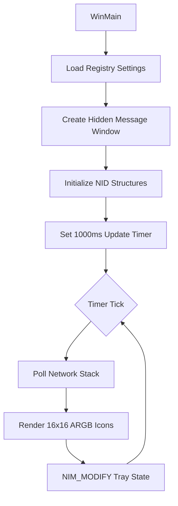

# SpeedMonitor-Lite

```text
    ___________________________________________________
   |                                                   |
   |   SPEED MONITOR LITE v1.0                         |
   |   [|||||||||||||||||||||||||||||||||        ]     |
   |___________________________________________________|
    Low Overhead . Zero Dependencies . Native Win32
```

A high-performance, ultra-lightweight Windows Internet Speed Widget that lives in your System Tray. Built with raw C++ and the Win32 API, it provides real-time download and upload telemetry without the bloat of modern frameworks.

### Dual-Icon Visualization

The app generates two independent, dynamic 16x16 pixel icons in your system tray. One for **Download** (Green Header) and one for **Upload** (Red Header).

#### Icon Structure & Units

Due to the standard Windows icon size constraints (**16x16 pixels**), each icon is limited to a **3-digit display**. The active unit is displayed as a series of colored blocks at the top of the icon:

*   **Bytes/s (B):** Solid bar across the top.
*   **Kilobytes/s (K):** One block at the top-left.
*   **Megabytes/s (M):** Two blocks at the top-left.
*   **Gigabytes/s (G):** Three blocks across the top.
*   **Max Value:** If speed exceeds 999 units, it remains at `999` to maintain readability, while the tooltip shows the exact value.

Here is exactly how the 16x16 pixels are drawn in your system tray:

**Example: 120 Megabytes/s (Download)**
*The green header with 2 blocks indicating "MB"*

```text
🟩🟩🟩🟩⬛🟩🟩🟩🟩⬛⬛⬛⬛⬛⬛⬛
🟩🟩🟩🟩⬛🟩🟩🟩🟩⬛⬛⬛⬛⬛⬛⬛
🟩🟩🟩🟩⬛🟩🟩🟩🟩⬛⬛⬛⬛⬛⬛⬛
⬛⬛⬛⬛⬛⬛⬛⬛⬛⬛⬛⬛⬛⬛⬛⬛
⬛⬛⬜⬛⬛⬛⬜⬜⬜⬜⬛⬛⬜⬜⬜⬜
⬛⬛⬜⬛⬛⬛⬛⬛⬛⬜⬛⬛⬜⬛⬛⬜
⬛⬛⬜⬛⬛⬛⬛⬛⬛⬜⬛⬛⬜⬛⬛⬜
⬛⬛⬜⬛⬛⬛⬛⬛⬛⬜⬛⬛⬜⬛⬛⬜
⬛⬛⬜⬛⬛⬛⬛⬛⬛⬜⬛⬛⬜⬛⬛⬜
⬛⬛⬜⬛⬛⬛⬜⬜⬜⬜⬛⬛⬜⬛⬛⬜
⬛⬛⬜⬛⬛⬛⬜⬛⬛⬛⬛⬛⬜⬛⬛⬜
⬛⬛⬜⬛⬛⬛⬜⬛⬛⬛⬛⬛⬜⬛⬛⬜
⬛⬛⬜⬛⬛⬛⬜⬛⬛⬛⬛⬛⬜⬛⬛⬜
⬛⬛⬜⬛⬛⬛⬜⬛⬛⬛⬛⬛⬜⬛⬛⬜
⬛⬛⬜⬛⬛⬛⬜⬛⬛⬛⬛⬛⬜⬛⬛⬜
⬛⬛⬜⬛⬛⬛⬜⬜⬜⬜⬛⬛⬜⬜⬜⬜
```

**Example: 45 Kilobytes/s (Upload)**
*The red header with 1 block indicating "KB"*

```text
🟥🟥🟥🟥⬛⬛⬛⬛⬛⬛⬛⬛⬛⬛⬛⬛
🟥🟥🟥🟥⬛⬛⬛⬛⬛⬛⬛⬛⬛⬛⬛⬛
🟥🟥🟥🟥⬛⬛⬛⬛⬛⬛⬛⬛⬛⬛⬛⬛
⬛⬛⬛⬛⬛⬛⬛⬛⬛⬛⬛⬛⬛⬛⬛⬛
⬛⬛⬛⬛⬛⬛⬜⬛⬛⬜⬛⬛⬜⬜⬜⬜
⬛⬛⬛⬛⬛⬛⬜⬛⬛⬜⬛⬛⬜⬛⬛⬛
⬛⬛⬛⬛⬛⬛⬜⬛⬛⬜⬛⬛⬜⬛⬛⬛
⬛⬛⬛⬛⬛⬛⬜⬛⬛⬜⬛⬛⬜⬛⬛⬛
⬛⬛⬛⬛⬛⬛⬜⬛⬛⬜⬛⬛⬜⬛⬛⬛
⬛⬛⬛⬛⬛⬛⬜⬜⬜⬜⬛⬛⬜⬜⬜⬜
⬛⬛⬛⬛⬛⬛⬛⬛⬛⬜⬛⬛⬛⬛⬛⬜
⬛⬛⬛⬛⬛⬛⬛⬛⬛⬜⬛⬛⬛⬛⬛⬜
⬛⬛⬛⬛⬛⬛⬛⬛⬛⬜⬛⬛⬛⬛⬛⬜
⬛⬛⬛⬛⬛⬛⬛⬛⬛⬜⬛⬛⬛⬛⬛⬜
⬛⬛⬛⬛⬛⬛⬛⬛⬛⬜⬛⬛⬛⬛⬛⬜
⬛⬛⬛⬛⬛⬛⬛⬛⬛⬜⬛⬛⬜⬜⬜⬜
```

#### Unit Indicator Reference
To clarify, here is how the top header pixels change based on the unit:

```text
Bytes/s (B)
🟩🟩🟩🟩🟩🟩🟩🟩🟩🟩🟩🟩🟩🟩🟩🟩
🟩🟩🟩🟩🟩🟩🟩🟩🟩🟩🟩🟩🟩🟩🟩🟩
⬛⬛⬛⬛⬛⬛⬛⬛⬛⬛⬛⬛⬛⬛⬛⬛

Kilobytes/s (K)
🟩🟩🟩🟩⬛⬛⬛⬛⬛⬛⬛⬛⬛⬛⬛⬛
🟩🟩🟩🟩⬛⬛⬛⬛⬛⬛⬛⬛⬛⬛⬛⬛
🟩🟩🟩🟩⬛⬛⬛⬛⬛⬛⬛⬛⬛⬛⬛⬛

Megabytes/s (M)
🟩🟩🟩🟩⬛🟩🟩🟩🟩⬛⬛⬛⬛⬛⬛⬛
🟩🟩🟩🟩⬛🟩🟩🟩🟩⬛⬛⬛⬛⬛⬛⬛
🟩🟩🟩🟩⬛🟩🟩🟩🟩⬛⬛⬛⬛⬛⬛⬛

Gigabytes/s (G)
🟩🟩🟩🟩⬛🟩🟩🟩🟩⬛🟩🟩🟩🟩⬛⬛
🟩🟩🟩🟩⬛🟩🟩🟩🟩⬛🟩🟩🟩🟩⬛⬛
🟩🟩🟩🟩⬛🟩🟩🟩🟩⬛🟩🟩🟩🟩⬛⬛
```

### First Time Setup & Hidden Icons

**Important:** The very first time you run SpeedMonitor-Lite, Windows will likely hide the newly created icons inside the "Hidden Icons" tray.
1. Click the `^` (up arrow) chevron in your taskbar near the clock.
2. Find the two SpeedMonitor icons (Download and Upload).
3. **Drag and drop** both icons directly onto your main taskbar area.
4. Windows will remember this choice, and the icons will always remain visible on your taskbar in the future!

### Why SpeedMonitor-Lite?

| Metric | SpeedMonitor-Lite | Typical Electron App |
| :--- | :--- | :--- |
| **Binary Size** | **31 KB** | ~150 MB+ |
| **RAM Usage** | **~7.5 MB** | ~200 MB+ |
| **CPU Usage** | **~1.0%** | 1% - 5% |

### Core Features

*   **Dynamic Tray Icons:** Real-time speed rendered directly using a proprietary `4x12` bitmapped font.
*   **Detailed Telemetry:** Hovering over an icon reveals Current Speed, Session Peak, and Total Data Consumed.
*   **Smart Configuration:** Persistent Registry-based settings for Auto-Start and Icon selection.
*   **Native Performance:** Zero runtime dependencies. No .NET, No V8, No overhead.

### Architecture



### Compilation

**MinGW (g++):**
```bash
g++ -Os -s -ffunction-sections -fdata-sections "-Wl,--gc-sections" main.cpp -o SpeedMonitor.exe -mwindows -lgdi32 -lshell32 -liphlpapi -lole32
```

---
```text
  [!] Designed for power users who value every clock cycle.
```
